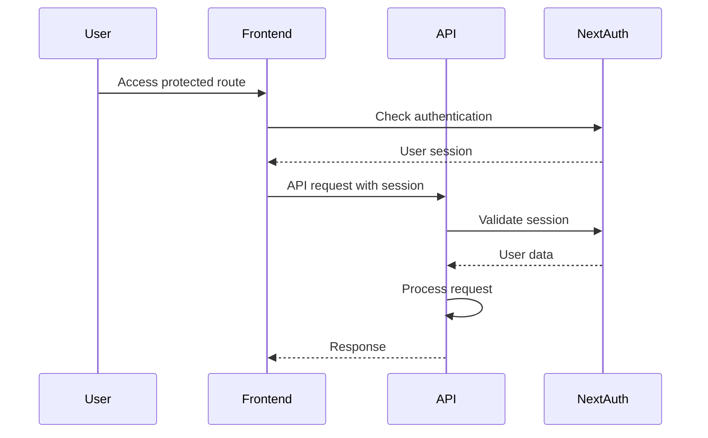

# Backend Architecture

## Service Architecture

### Function Organization
```
src/app/api/
├── conversations/
│   ├── route.ts            # GET, POST /conversations
│   └── [id]/
│       └── route.ts        # GET, PUT, DELETE /conversations/[id]
├── chat/
│   └── route.ts            # POST /chat (LLM integration)
├── sync/
│   └── route.ts            # Real-time state synchronization
└── health/
    └── route.ts            # Health check endpoint
```

### Function Template
```typescript
import { NextRequest, NextResponse } from 'next/server';
import { ConversationService } from '@/services/conversationService';

export async function GET(request: NextRequest) {
  try {
    const conversations = await ConversationService.getAll();
    return NextResponse.json(conversations);
  } catch (error) {
    return NextResponse.json(
      { error: 'Failed to fetch conversations' },
      { status: 500 }
    );
  }
}

export async function POST(request: NextRequest) {
  try {
    const body = await request.json();
    const conversation = await ConversationService.create(body);
    return NextResponse.json(conversation, { status: 201 });
  } catch (error) {
    return NextResponse.json(
      { error: 'Failed to create conversation' },
      { status: 500 }
    );
  }
}
```

## Database Architecture

### Schema Design
```typescript
// MongoDB Schema with Mongoose
import mongoose from 'mongoose';

const PositionSchema = new mongoose.Schema({
  x: { type: Number, required: true },
  y: { type: Number, required: true }
});

const NodeSchema = new mongoose.Schema({
  id: { type: String, required: true, unique: true },
  type: { type: String, enum: ['input', 'loading', 'completed'], required: true },
  userMessage: { type: String, required: true },
  assistantResponse: { type: String, default: '' },
  position: { type: PositionSchema, required: true },
  createdAt: { type: Date, default: Date.now },
  updatedAt: { type: Date, default: Date.now },
  parentNodeId: { type: String, required: false }
});

const EdgeSchema = new mongoose.Schema({
  id: { type: String, required: true, unique: true },
  sourceNodeId: { type: String, required: true },
  targetNodeId: { type: String, required: true },
  type: { type: String, enum: ['auto', 'manual', 'markdown'], required: true },
  createdAt: { type: Date, default: Date.now },
  metadata: {
    markdownElementId: { type: String, required: false },
    contextSnippet: { type: String, required: false }
  }
});

const ConversationSchema = new mongoose.Schema({
  id: { type: String, required: true, unique: true },
  title: { type: String, required: true },
  createdAt: { type: Date, default: Date.now },
  updatedAt: { type: Date, default: Date.now },
  nodes: [NodeSchema],
  edges: [EdgeSchema],
  metadata: {
    nodeCount: { type: Number, default: 0 },
    lastActiveNodeId: { type: String, required: false },
    tags: [{ type: String }]
  }
});

export const Conversation = mongoose.model('Conversation', ConversationSchema);
```

### Data Access Layer
```typescript
export class ConversationRepository {
  static async create(data: Partial<Conversation>): Promise<Conversation> {
    const conversation = new Conversation(data);
    return await conversation.save();
  }
  
  static async findById(id: string): Promise<Conversation | null> {
    return await Conversation.findOne({ id });
  }
  
  static async findAll(): Promise<Conversation[]> {
    return await Conversation.find().sort({ updatedAt: -1 });
  }
  
  static async update(id: string, data: Partial<Conversation>): Promise<Conversation | null> {
    return await Conversation.findOneAndUpdate(
      { id },
      { ...data, updatedAt: new Date() },
      { new: true }
    );
  }
  
  static async delete(id: string): Promise<boolean> {
    const result = await Conversation.deleteOne({ id });
    return result.deletedCount > 0;
  }
}
```

## Authentication and Authorization

### Auth Flow


### Middleware/Guards
```typescript
import { withAuth } from 'next-auth/middleware';

export default withAuth(
  function middleware(req) {
    // Additional middleware logic
  },
  {
    callbacks: {
      authorized: ({ token }) => !!token
    }
  }
);

export const config = {
  matcher: ['/chat/:path*', '/api/conversations/:path*']
};
```
