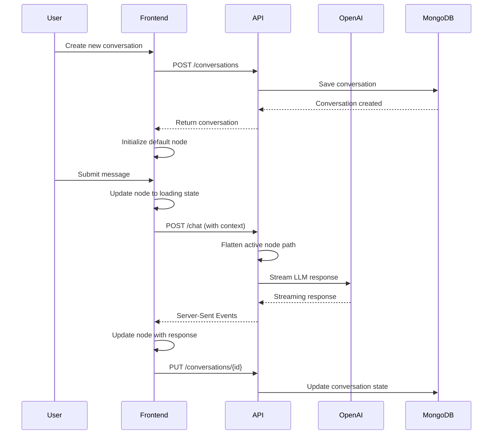
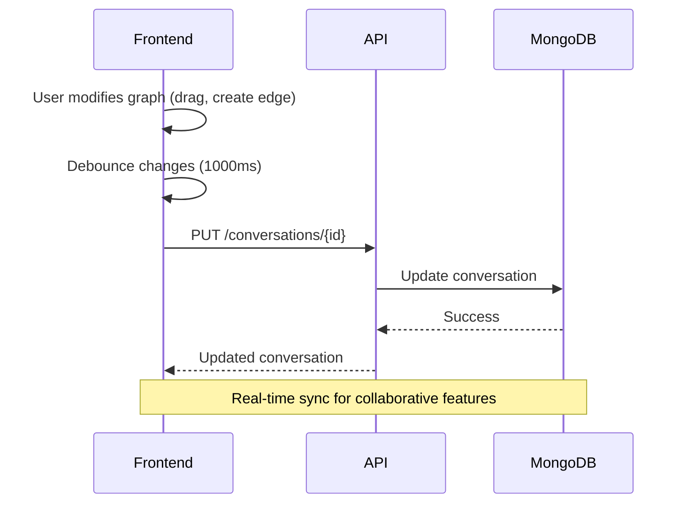

# Core Workflows

## Conversation Creation and Node Interaction

```mermaid
sequenceDiagram
    participant U as User
    participant F as Frontend
    participant A as API
    participant O as OpenAI
    participant D as MongoDB
    
    U->>F: Create new conversation
    F->>A: POST /conversations
    A->>D: Save conversation
    D-->>A: Conversation created
    A-->>F: Return conversation
    F->>F: Initialize default node
    
    U->>F: Submit message
    F->>F: Update node to loading state
    F->>A: POST /chat (with context)
    A->>A: Flatten active node path
    A->>O: Stream LLM response
    O-->>A: Streaming response
    A-->>F: Server-Sent Events
    F->>F: Update node with response
    F->>A: PUT /conversations/{id}
    A->>D: Update conversation state
```

## Graph State Synchronization

```mermaid
sequenceDiagram
    participant F as Frontend
    participant A as API
    participant D as MongoDB
    
    F->>F: User modifies graph (drag, create edge)
    F->>F: Debounce changes (1000ms)
    F->>A: PUT /conversations/{id}
    A->>D: Update conversation
    D-->>A: Success
    A-->>F: Updated conversation
    
    Note over F,D: Real-time sync for collaborative features
```
