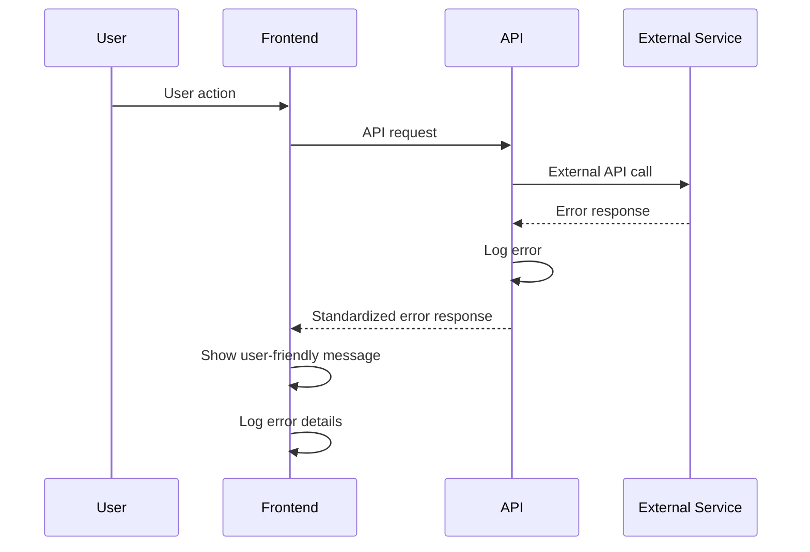

# Error Handling Strategy

## Error Flow



## Error Response Format

```typescript
interface ApiError {
  error: {
    code: string;
    message: string;
    details?: Record<string, any>;
    timestamp: string;
    requestId: string;
  };
}

// Example error responses
{
  "error": {
    "code": "CONVERSATION_NOT_FOUND",
    "message": "The requested conversation could not be found",
    "timestamp": "2025-01-15T10:30:00Z",
    "requestId": "req_123456789"
  }
}
```

## Frontend Error Handling

```typescript
export class ErrorHandler {
  static handleApiError(error: ApiError): string {
    const errorMessages = {
      'CONVERSATION_NOT_FOUND': 'Conversation not found. Please try again.',
      'INVALID_INPUT': 'Please check your input and try again.',
      'NETWORK_ERROR': 'Network error. Please check your connection.',
      'DEFAULT': 'Something went wrong. Please try again.'
    };
    
    return errorMessages[error.error.code] || errorMessages.DEFAULT;
  }
  
  static logError(error: Error, context: string): void {
    console.error(`[${context}]`, error);
    // Send to error tracking service
  }
}
```

## Backend Error Handling

```typescript
export class ApiError extends Error {
  constructor(
    public code: string,
    message: string,
    public statusCode: number = 500,
    public details?: Record<string, any>
  ) {
    super(message);
    this.name = 'ApiError';
  }
}

export function handleApiError(error: unknown): NextResponse {
  if (error instanceof ApiError) {
    return NextResponse.json(
      {
        error: {
          code: error.code,
          message: error.message,
          details: error.details,
          timestamp: new Date().toISOString(),
          requestId: crypto.randomUUID()
        }
      },
      { status: error.statusCode }
    );
  }
  
  // Log unexpected errors
  console.error('Unexpected error:', error);
  
  return NextResponse.json(
    {
      error: {
        code: 'INTERNAL_SERVER_ERROR',
        message: 'An unexpected error occurred',
        timestamp: new Date().toISOString(),
        requestId: crypto.randomUUID()
      }
    },
    { status: 500 }
  );
}
```
