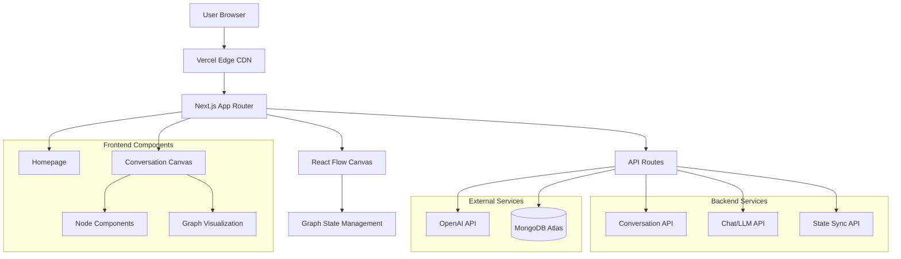

# High Level Architecture

## Technical Summary

Graph-GPT implements a modern fullstack architecture using Next.js 14+ with App Router for seamless frontend-backend integration. The system leverages MongoDB for flexible graph data storage, React Flow for interactive graph visualization, and OpenAI API integration for streaming LLM responses. The architecture follows a monorepo structure with shared TypeScript types, enabling rapid development of the graph-based conversation interface. Deployment utilizes Vercel's serverless platform for optimal performance and scalability, with real-time state synchronization ensuring consistent graph state across sessions.

## Platform and Infrastructure Choice

**Platform:** Vercel  
**Key Services:** Vercel Functions, Vercel Edge Network, MongoDB Atlas, OpenAI API  
**Deployment Host and Regions:** Global Edge Network (Primary: US East, EU West, Asia Pacific)

**Rationale:** Vercel provides seamless Next.js integration, automatic scaling, and global edge deployment. MongoDB Atlas offers managed database services with excellent Next.js compatibility. This combination enables rapid development and deployment while maintaining high performance for the graph-based interface.

## Repository Structure

**Structure:** Monorepo with npm workspaces  
**Monorepo Tool:** npm workspaces (built-in)  
**Package Organization:** Apps (web) + Packages (shared, ui, config)

## High Level Architecture Diagram

## Architectural Patterns

- **Jamstack Architecture:** Static site generation with serverless APIs - _Rationale:_ Optimal performance and scalability for the graph interface
- **Component-Based UI:** Reusable React components with TypeScript - _Rationale:_ Maintainability and type safety across the graph visualization system
- **Repository Pattern:** Abstract data access logic - _Rationale:_ Enables testing and future database migration flexibility
- **State Management Pattern:** React Context with useReducer - _Rationale:_ Centralized graph state management with predictable updates
- **Streaming Pattern:** Server-Sent Events for real-time LLM responses - _Rationale:_ Efficient real-time communication without WebSocket complexity
- **Graph Traversal Pattern:** Custom algorithms for path calculation - _Rationale:_ Optimized for conversation context and node activation logic
